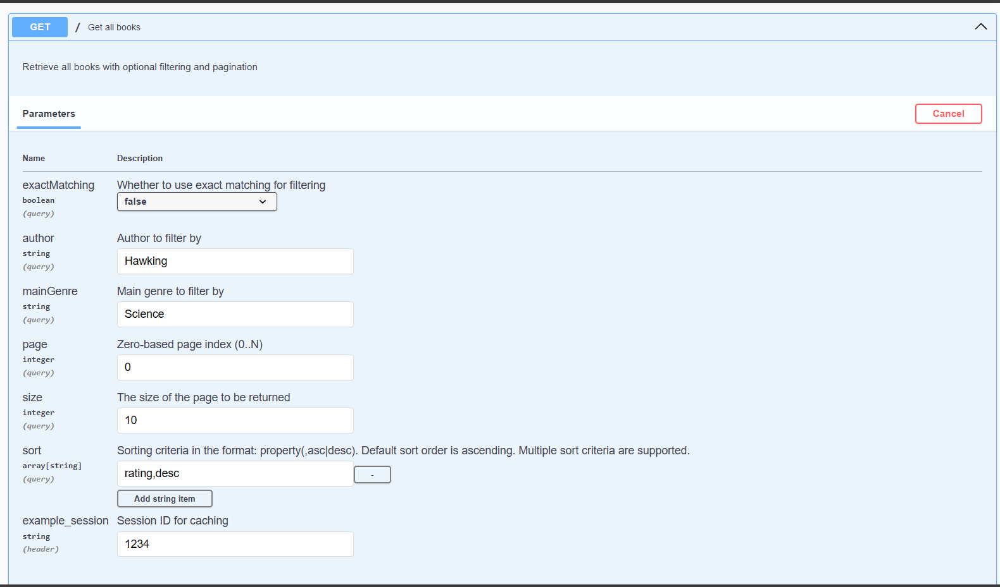
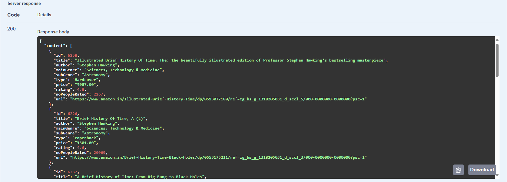
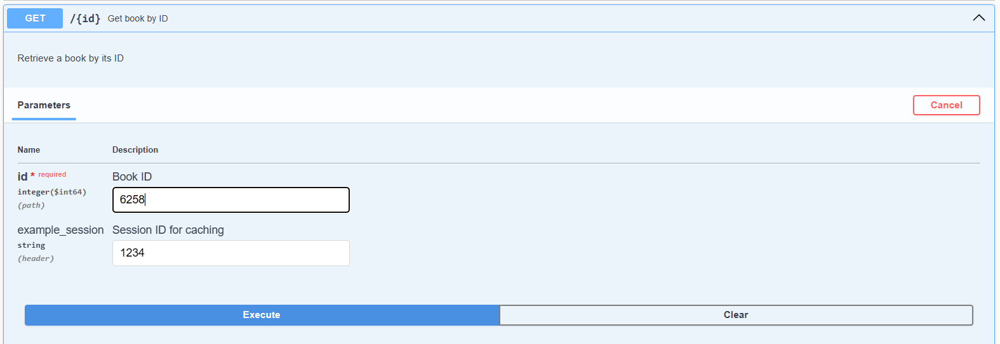
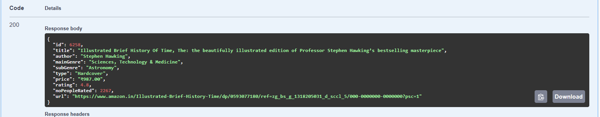
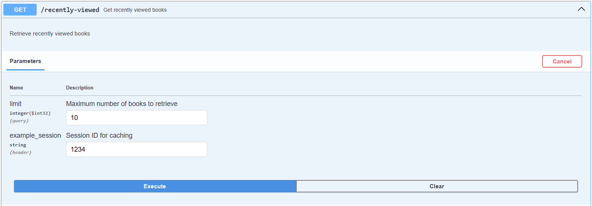
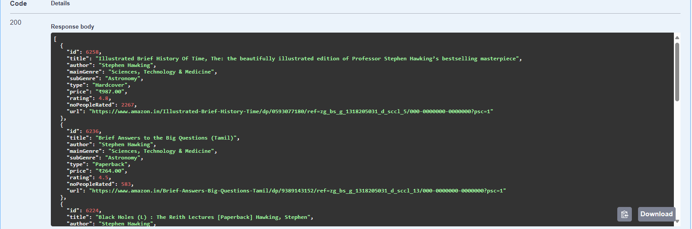

# Books API


### Descrição da Solução Implementada

Esta API fornece informações sobre livros, permitindo a recuperação de uma lista paginada, detalhes de um livro específico e livros visualizados recentemente. A aplicação utiliza dados públicos do dataset Books, encontrado em [Kraggle - amazon-books-dataset](https://www.kaggle.com/datasets/chhavidhankhar11/amazon-books-dataset?resource=download) que possui 7928 registros. 

#### Funcionalidades da API

1. **Obter Todos os Livros**:
   - Endpoint: `GET /books`
   - Descrição: Permite a recuperação de uma lista paginada de livros. Suporta filtros opcionais por autor e gênero principal, além de permitir ordenação dos dados.
   - Parâmetros:
      - `pageable`: Parâmetros de paginação e ordenação.
      - `exactMatching`: Booleano para definir se a busca deve ser exata ou parcial.
      - `author`: Filtro opcional pelo autor do livro.
      - `mainGenre`: Filtro opcional pelo gênero principal do livro.
      - `sessionId`: Header opcional para identificar a sessão do usuário. Utilizada para caching dos dados. (nesta api não foi implementada autenticação.)

2. **Obter Livro por ID**:
   - Endpoint: `GET /books/{id}`
   - Descrição: Recupera os detalhes de um livro específico com base no seu ID.
   - Parâmetros:
      - `id`: ID do livro a ser recuperado.
      - `sessionId`: Header opcional para identificar a sessão do usuário.

3. **Obter Livros Visualizados Recentemente**:
   - Endpoint: `GET /books/recently-viewed`
   - Descrição: Retorna uma lista de livros que foram visualizados recentemente pela atual sessão.
   - Parâmetros:
      - `limit`: Número máximo de livros a serem retornados.
      - `sessionId`: Header opcional para identificar a sessão do usuário.

### Principais Tecnologias Utilizadas
1. **Spring Boot 3 (Java 17)**: Utilizado como framework principal para desenvolvimento da API.
2. **Spring Data JPA**: Usado para a persistência de dados.
3. **PostgreSQL**: Banco de dados principal utilizado.
4. **Redis**: Utilizado para caching.
5. **Flyway**: Gerenciamento de migrações de banco de dados.
6. **MapStruct**: Utilizado para mapeamento de entidades.
7. **Lombok**: Utilizado para facilitar a escrita de código eliminando a necessidade de escrever códigos repetitivos.
9. **H2**: Banco de dados em memória utilizado para testes.
10. **Embedded Redis Server**: Redis embarcado para o ambiente de testes.
11. **Cucumber**: Ferramenta para realização de testes seguindo o padrão BDD.
11. **Docker**: Permite que a aplicação execute em um container isolado.

### Decisões de Design
1. **Migrations**: Foi utilizada a ferramenta Flyway para carregar a base de livros no banco de dados. Assim, a aplicação pode ser configurada e inicializada de forma fácil em diferentes ambientes, além de garantir a consistência dos dados.
3. **Arquitetura Hexagonal**: A aplicação segue a arquitetura hexagonal, que permite a separação de responsabilidades entre as 3 camadas da API: aplicação, domínio e infraestrutura.
4. **Banco de dados relacional**: A escolha de um banco de dados relacional é justificada pela natureza dos dados obtidos do dataset.
5. **SwaggerUI**: Documentação da API gerada automaticamente pelo SwaggerUI, permitindo que os desenvolvedores possam entender e testar a API de forma mais fácil.
6. **Testes com o Cucumber**: Utilização do Cucumber para testes de integração, permitindo a escrita de testes seguindo o padrão BDD.
7. **Listagem de livros**: 
   1. Paginação: A listagem de livros é paginada para melhorar a performance e reduzir o tempo de resposta.
   2. Filtros: Filtros opcionais por autor e gênero principal com a possibilidade de pesquisar por termos exatos ou parciais.
   3. Ordenação: A ordenação dos livros pode ser feita para que o consumidor possua mais controle sobre a pesquisa.
8. **Tratamento de Exceptions**: A classe com.codeelevate.books.application.advice.GlobalExceptionHandler é responsável por tratar as exceções levantadas e adicionar um código HTTP apropriado para a resposta.
9. **Caching**: Implementação de caching utilizando Redis para melhorar a performance da aplicação e possibilitar funcionalidades como "listar mais recentes", sem adicionar mais complexidade ao banco de dados.
   1. **SessionId**: Utilização de um sessionId para identificar a sessão do usuário e permitir o caching dos livros visualizados recentemente.
   2. **Time to Live**: Configuração do tempo de vida do cache para 30 minutos, com o objetivo de reduzir a quantidade de dados armazenados e garantir a atualização dos livros visualizados recentemente.

## Plano de Implementação

1. **Configuração do ambiente**: Foi utilizada a ferramenta Docker para facilitar a configuração em diferentes ambientes.
   - `docker-compose.yaml`: Configuração do ambiente com PostgreSQL, Redis e aplicação.
   - `Dockerfile`: Utilização das imagens eclipse-temurin (JDK 17) e maven wrapper para fazer o build da API.

2. **Carregar base de dados**: Foi utilizado o Flyway para carregar o dataset books.csv no banco de dados.
   - `db.migration`: A pasta /resources/db/migration contém os scripts SQL para criação da tabela `book`.
   - `books.csv`: O dataset books.csv, encontrado em resources/static, é importado pelo Flyway através do script resources/db/migration/V1__load_books.sql que executa antes da aplicação.
   - `Criação de indexes`: Através do arquivo V4__create_index.sql, são criados índices para melhorar a performance das consultas.

3. **Construção da API**:
   - `Listagem por filtros`: Na classe com.codeelevate.books.infra.BookProviderImpl foi realizada a implementação da pesquisa por filtros utilizando a API Example do Spring Data JPA. Com ela também foi possível configurar para que a busca seja exata ou parcial e também Case Insensitive através a classe ExampleMatcher. 
   - `Spring Cache Redis`: Implementação do caching utilizando o Redis e o Spring Cache que permite a utilização da anotação @Cacheable. Esta é uma forma de definir que o resultado de um método deve ser armazenado em cache.
   - `RedisTemplate e ZSetOperations`: Na classe com.codeelevate.books.infra.BookProviderImpl foi utilizado o RedisTemplate para armazenar e recuperar os livros visualizados recentemente. Através da interface ZSetOperations foi possível armazenar os livros em um Set (conjunto) que é ordenado pelo timestamp. Assim é possível recuperar os livros ordenados por ordem de visualização.
   - `Testes`: Foram implementados testes de integração utilizando o Cucumber para verificar as funcionalidades da API. Ao iniciar o ambiente de testes, o Hibernate cria as tabelas em um banco de dados em memória H2 (com os dados o arquivo import.sql) e o Redis é iniciado em um servidor embarcado. Assim, os testes são realizados em um ambiente isolado e os dados não interferem no ambiente de desenvolvimento. O arquivo BooksApi.feature contém os cenários de teste e a classe BooksApiSteps contém a implementação dos passos dos testes.

### Melhorias e Considerações Finais
O projeto pode ser melhorado com a implementação de novas funcionalidades. Algumas melhorias sugeridas são:
1. **Autenticação e Autorização**: Implementar autenticação e autorização para proteger a API e permitir que apenas usuários autenticados possam acessar as funcionalidades.
2. **Logging**: Adicionar logging para monitorar o comportamento da aplicação e identificar possíveis problemas.


### Instalação e Execução

#### Pré-requisitos
- [Docker](https://www.docker.com/)

#### Configuração e Build
1. Clone ou baixe o [repositório](https://github.com/caiohsfar/books-api):
   ```bash
   git clone https://github.com/caiohsfar/books-api.git
   cd books-api
   ```
2. Renomeie o arquivo `.env-example` para `.env` que está na raiz da aplicação. Este arquivo contém as conexões. Você pode utilizar as configurações padrão que está no arquivo.
   ```bash
   mv .env-example .env
   ```
3. Execute o Docker Compose para iniciar a aplicação:
   ```bash
   docker compose up
   ```
4. Acesse a documentação da API no [SwaggerUI](http://localhost:8080/swagger-ui.html)

#### Execução dos Testes

1. Faça uma pesquisa por livros utilizando o endpoint `/books`.



2. Obtenha os detalhes de um livro específico utilizando o endpoint `/books/{id}`.



3. Obtenha os livros visualizados recentemente utilizando o endpoint `/books/recently-viewed`.



Obs.: passe o sessionId no header das chamadas para ativar o caching e pesquisar os livros recentemente visualizados.


